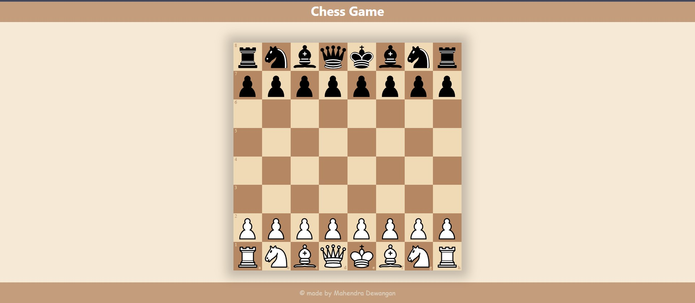

# **Chess Game - React app** 
 <h3>This is classical Chess game build with react js</h3>

 

## **Description 📃**
- Chess is a board game for two players. Chess is a game played between two opponents on opposite sides of a board containing 64 squares of alternating colors. Each player has 16 pieces: 1 king, 1 queen, 2 rooks, 2 bishops, 2 knights, and 8 pawns. 
- The goal of the game is to checkmate the other king.
- This project is built on a basic web tech stacks such as HTML, CSS and Javascript.

## **functionalities 🎮**
- All the chess pieces are draggable 
- place your chess pieces on your desired location.

 

## **How to play? 🕹️**
- Both the players can play by dragging a piece to your desired location.
- Capture opponent's pieces
- At last, the player whose king is left, wins the game.

**How to start?**   
*In the project directory, you can run:*

### `npm start`

Runs the app in the development mode.\
Open [http://localhost:3000](http://localhost:3000) to view it in your browser.

The page will reload when you make changes.\
You may also see any lint errors in the console.

 

## **Screenshots 📸**

 

 
