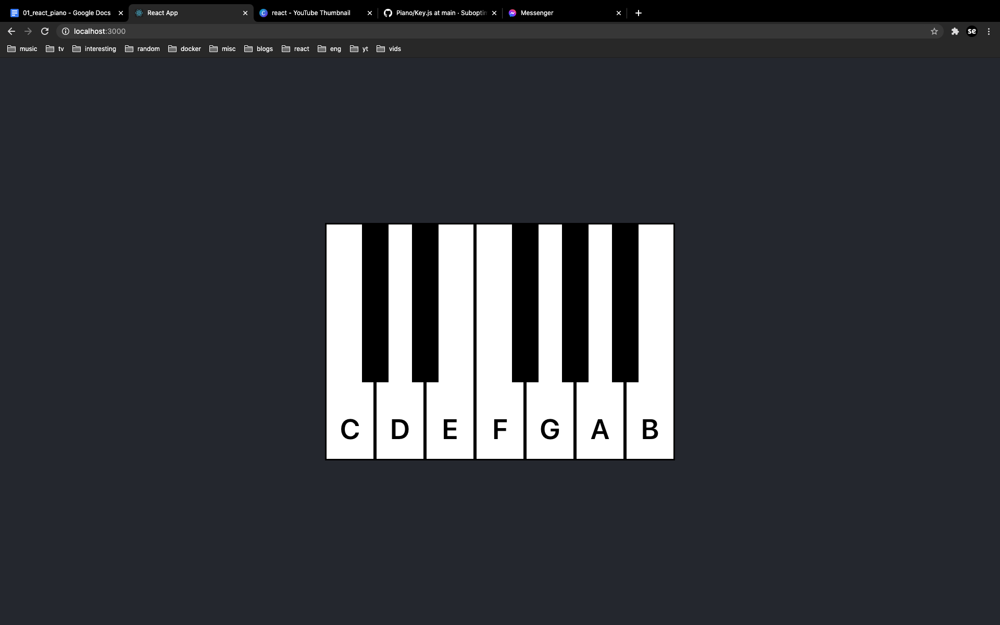
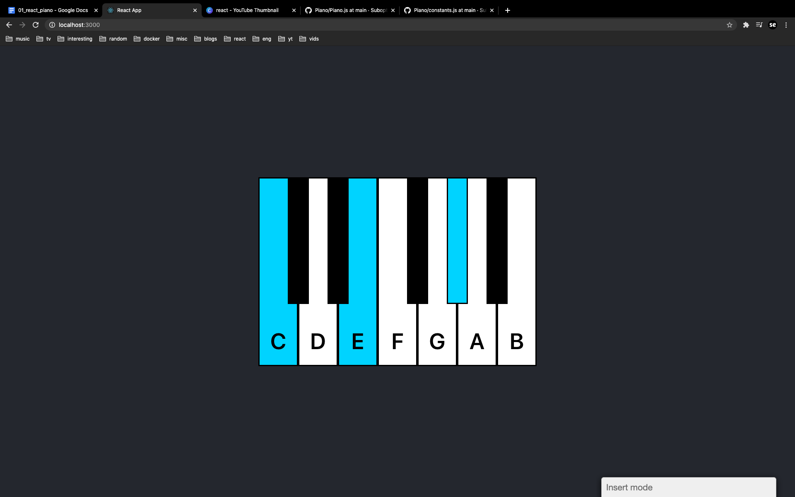

# README

## Setup

Getting started with this project is very easy. Run:

```
npm install
npm start
```

If you get a `react-scripts start` error, then remove the `node_modules`
folder and re-run the two commands in the code block.

## Demo

#### Piano UI
<div class="flex flex-row">
  
  
</div>
